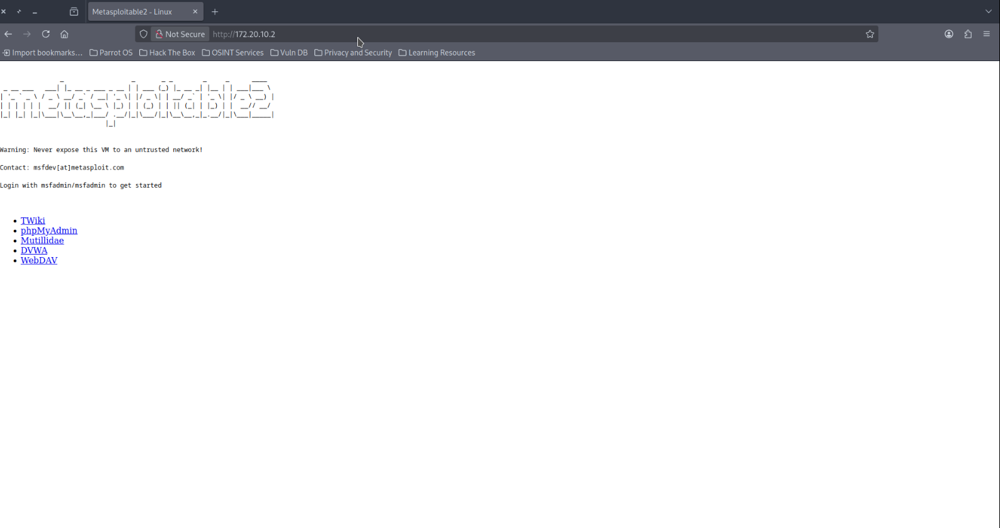
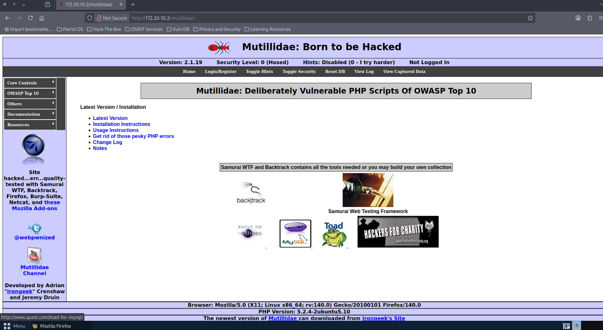
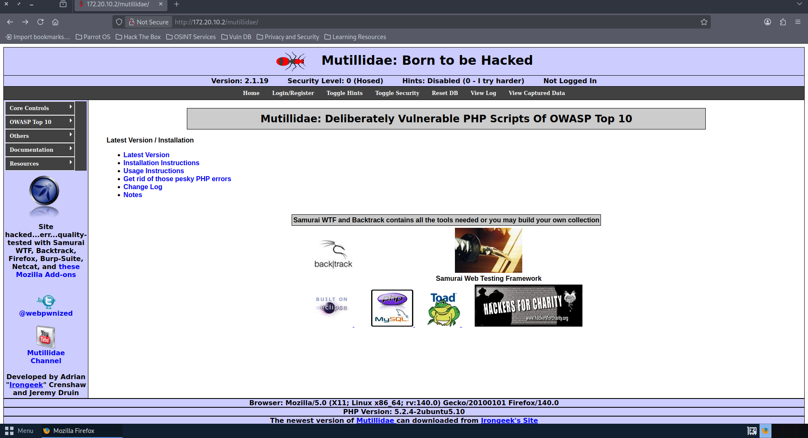
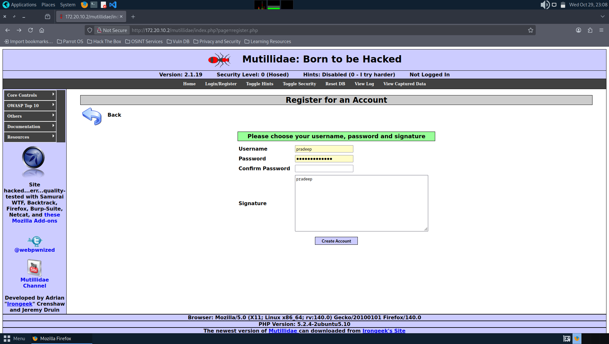
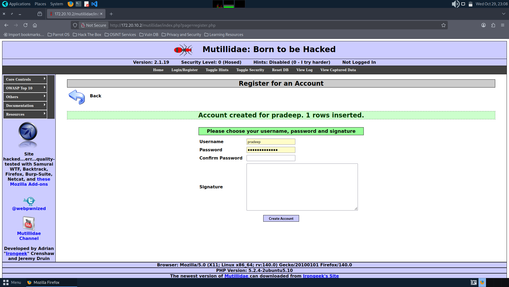
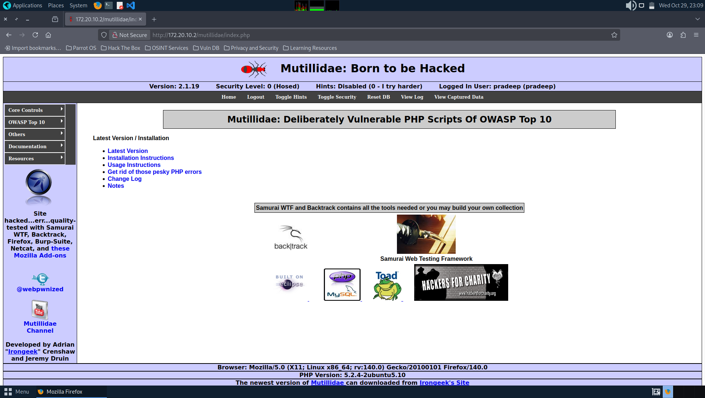
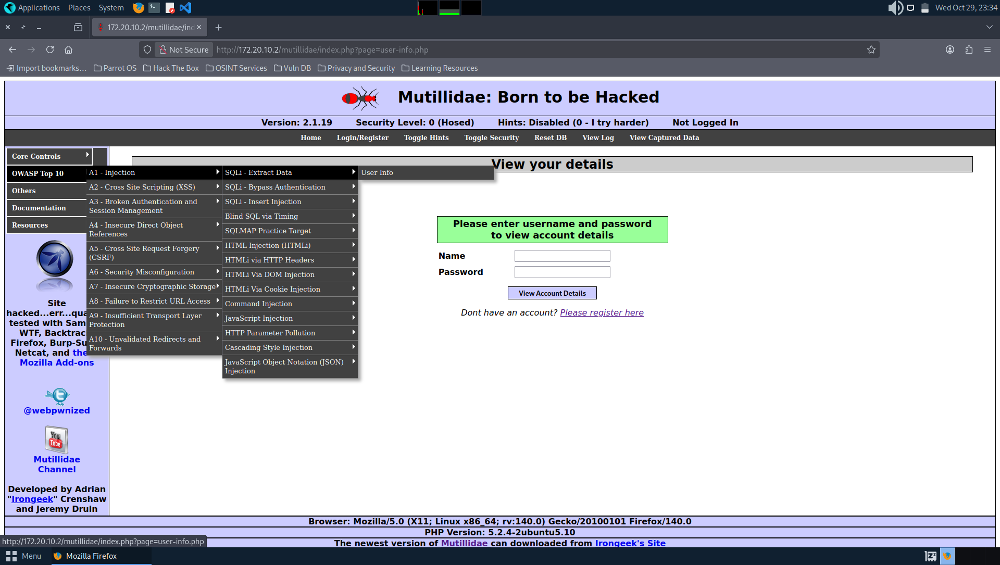
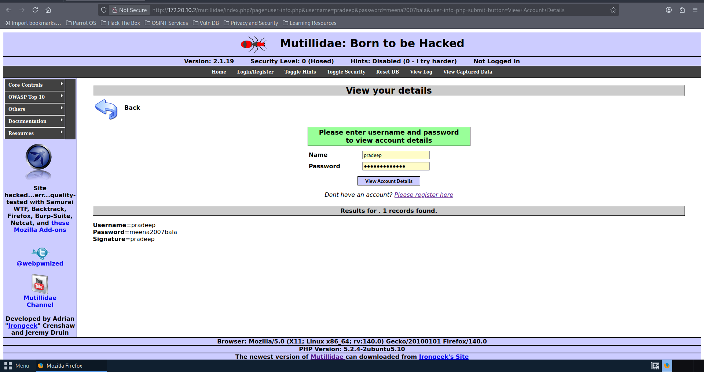
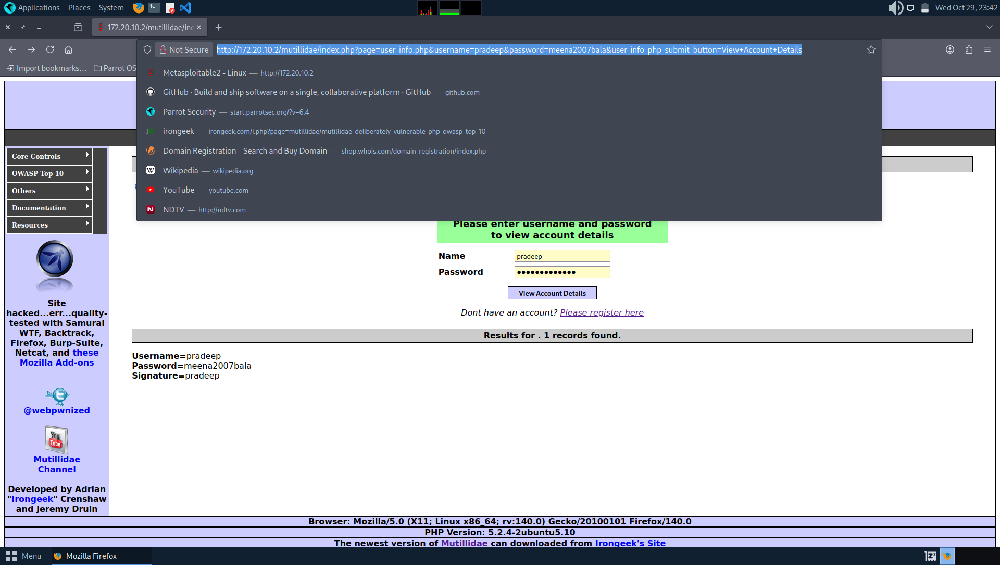

# sqlinjection
Exploiting SQL Injection vulnerability

# AIM:
To exploit SQL Injection vulnerability using Multidae web application in Metasploitable2

## DESIGN STEPS:

### Step 1:

Install kali linux either in partition or virtual box or in live mode

### Step 2:

Investigate on the various categories of tools as follows:

### Step 3:

Open terminal and try execute some kali linux commands

## EXECUTION STEPS AND ITS OUTPUT:

SQL Injection is a sort of infusion assault that makes it conceivable to execute malicious SQL statements. These statements control a database server behind a web application. Assailants can utilize SQL Injection vulnerabilities to sidestep application safety efforts. They can circumvent authentication and authorization of a page or web application and recover the content of the whole SQL database. 
Identify IP address using ifconfig in Metasploitable2
#OUTPUT

Use the above ip address to access the apache webserver of Metasploitable2 from kali/parrot linux. In Kali Linux use the ip address in a web browser.
##  OUTPUT

Select Multidae from the menu listed as shown above. The page is displayed as below:
##  OUTPUT

Click on the menu Login/Register and register for an account
##  OUTPUT

Click on the link “Please register here”
##  OUTPUT

Click on “Create Account” to display the following page:
##  OUTPUT

The login structure we will use in our examples is straightforward. It contains two input fields (username and password), which are both vulnerable. The back-end content creates a query to approve the username and secret key given by the client. Here is an outline of the page rationale:

($query = “SELECT * FROM users WHERE username=’$_POST[username]’ AND password=’$_POST[password]’“;).
 For the username put “ganesh” or “anything” and for the password put (anything’ or ‘1’=’1) or (admin’ or ‘1’=’1) then try to log in, and you’ll be presented with an admin login page.
##  OUTPUT

Click “Login”. The logged in page will show as below:
##  OUTPUT

If error faced in registration follow the following steps in metasploitable 2:

This issue is caused by a misconfiguration in the config.inc located in the /var/www/mutillidae folder on Metasploitable 2 VM.

Edit config.inc
Edit config.inc file located in /var/www/mutillidae folder on Metasploitable 2 by typing the following commands [one at the time]:
cd /
sudo nano /var/www/mutillidae/config.inc
Type msfadmin when prompted for the root password. 
Once nano opens config.inc file, look for the line $dbname = ‘metasploit’ as shown in Figure  below:
##  OUTPUT

Replace ‘metasploit’ with ‘owasp10’ and make sure the lines end with semicolon ; as shown in Figure
##  OUTPUT

Save and exit the config.inc
Save than exit the config.inc file by typing CTRL+X keys on your keyboard and the Y [Enter] when prompted to save the file
Restart the Apache server
To restart Apache, type the following command in the terminal. Alternatively, you can just reboot Metasploitalbe 2 VM.
sudo /etc/init.d/apache2 reload
##  OUTPUT

# Reset Mutillidae database
Refresh the page then clicking on the Reset DB menu option to reset the Mutillidae database [Figure ]. Click OK when prompted.
##  OUTPUT

# Test the new configuration
Alright. Now is time to test if we managed to fix the database issue. Go ahead and register a new account on the Mutillidae webpage.

 
##  OUTPUT

## RESULT:
The SQL Injection vulnerability is successfully exploited using the Multidae web application in Metasploitable2.
